# User Guide

Smart Licensing Application is a web-based application, use any standard web browser(Chrome, Firefox, Safari or IE) to launch the application.

## To Check, if app is running
App will be running, if it is setup/installed using the install script. To check, if the app is running:

**In macOS/Linux:**
```
$ ps -ef | grep slta
 user  3341     1  0 Feb12 ?        00:00:00 python3 slta_resful.py
 user  3347  3341  1 Feb12 ?        00:41:06 /home/user/venv/bin/python3 slta_resful.py
```

When the app is running, there will be 2 processes. Otherwise the app is not running.  

## To Start the App

**In macOS/Linux:**  

To start the app, go to the folder where the app is installed and execute the following command in a terminal:  

 ```
 $ nohup python3 slta_resful.py &
 ```
App will be started in the background and the app logs will be sent to 'nohup.out' 

**In Windows:**  

Open a "Command Prompt", go to the app source folder and execute the following:  
```
start python slta_resful.py
```

## To Stop the App

**In macOS/Linux:**  

To stop the app, find the processes and kill them.  

```
 $ ps -ef | grep slta  
 user  3341     1  0 Feb12 ?        00:00:00 python3 slta_resful.py  
 user  3347  3341  1 Feb12 ?        00:41:06 /home/user/venv/bin/python3 slta_resful.py  
 $ kill -9 3341 3347  
```

**In Windows:**  

To stop the running app, press *_Ctrl + c_* on the "Command Prompt" window on which the python application is running. Or close that window.    


## To Launch App
This is a web-based app, will be launched using the URL - https://0.0.0.0:5000 on the computer/server where it is running.  
 (If app is launched from another computer, use the IP or Hostname to launch it)  
  
### Self-Signed Certificate
Communication between frontend and backend is secured by SSL/TLS. Launching the app in the browser will show 'Privacy error' - your connection is not private. Since the app using self-signed certificate, browser is showing this error. This can be ignored. User needs to manually make the browser to trust this self-signed certificate.  
  

<br>

  
Accept to proceed unsafe to trust the self-signed certificate.  
  
  

Note: The screenshots shown here are from Chrome browser. It will be similar for other browsers, but the look and feel will be different.  
  

## App Home
When the app is launched, user will land on App Home.  

 ![App Home][AppHome]

 
 Home has 2 sections:
 * New Registration  
    All new registations will start here. This section has 2 sub sections,
    * SL - Connected Network  
      This option will be used to register devices in connected network
    * SLR - Disconnected Network  
      This option will be used to reserve device licenses in disconnected network
* Previous Registrations  
    Previous 10 registrations that user has performed on this app will be shown here.  
    The name in previous registration is a link, clicking on the link will take the user to the place where user left it. App maintains the state and status of the registration so that user can resume to the step where it was left.  
  
## New Registration: SL - Connected Network
In Connected Network, devices will have connectivity to Cisco Smart Software Management(CSSM) via Smart Call Home and this app running computer will have connectivity to Internet to connect to Cisco's CSSM API Gateway which is running on the cloud. User will choose this option when there is direct connectivity as mentioned above between user's network and Internet.  

User needs to do the following to perform the SL-Connected Network registration:  
* Make sure on the devices  
  * Callhome configured and has connectivity to Cisco Cloud
  * RESTConf and User Authentication to allow RESTConf access(refer to product configuration manual to configure RESTConf and user access)
* User has a valid Cisco account with Smart Account(SA) and Virtual Account(VA) set up properly
* VA has required licenses for the devices/products going to be registered
* App running computer has connectivity to devices(to be registered) and to Internet(to connect to Cisco Cloud)

User needs to prepare a Comma Separated Value(CSV) file with device details and CSSM account details to perform SL - Connected Network registration. There is a sample CSV file available to download from 'Device Details Upload' in the app.  

Here is the content of CSV file of SL - Connected Network Registration:
* ipaddr - IP Address of the device
* user - User name to access the device
* password - Password to access the device
* sa_name - Smart Account(SA) Name that is associated with the user's Cisco Account(CCO)
* va_name - Virtual Account Name that belongs to the SA
* domain - Domain name of the SA
(Note: User's SA, VA and Domain Names can be obtained from CSSM by logging on to [CSSM](https://software.cisco.com))  

Here is a sample SL CSV file content:  
```
ipaddr,username,password,sa_name,va_name,domain
10.10.10.11,user101,xef$oc30,Networking Inc,Dev-VA1,dev.networking.com
10.10.10.12,user101,xef$oc30,Networking Inc,Dev-VA1,dev.networking.com
```
When CSV file with device details and CSSM account details is prepared, click on 'Start' to start the SL - Connected Network Registration.  

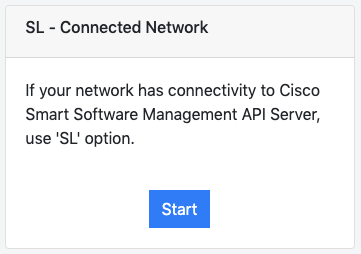

<br>
Click 'Start' will go to 'Device Details Upload'.  
  
### Device Details File Upload

'Device Details Upload' will allow user to upload a CSV file to register the devices.  

  

(Note: There a sample SL CSV file available to download, click on the link to download the sample CSV file)  

Click on 'Choose File' to browse and select a SL CSV file to upload. 'Upload' button will be enabled only when the file is selected.  

  

When a file is selected, click on 'Upload'.  

'Device Details' will be shown when the uploaded file is a valid file(refer to sample SL CSV for the format). Otherwise an error will be shown.  

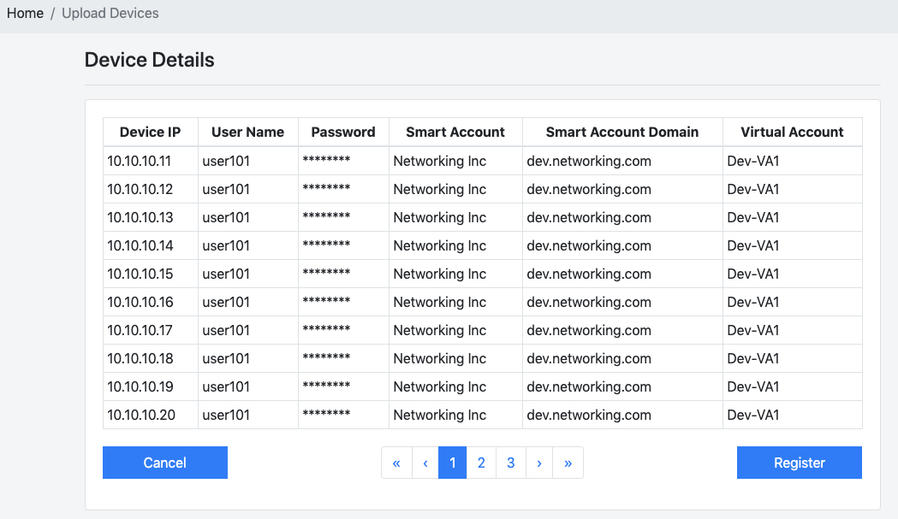  

'Device Details' will show the CSV file content. User can check the device details that are uploaded. 'Device Details' is paginated, each page consists of 10 devices. If user has uploaded more than 10 devices, pagination will show page links to navigate to different pages.  
  
### Register

Now user is ready to register the devices. User needs to click on 'Register' to get the devices registered with CSSM.  

When user clicks on 'Register', following will happen:  
* User will be asked to provide the Cisco credentials to get authorized to access the CSSM
  * CSSM login pop up will show up to get username and password
  * If user has already logged into CSSM, same authorization will be re-used until it is valid
  * App will use authorization token for 45 mins, before it gets a new one
* App gets a CSSM SL Token using CSSM REST API via Mule Soft API cloud gateway
  * App retrieves the first valid token from the specified SA and VA
  * If there is no token available, it creates a new one
* App registers the devices with CSSM using obtained SL Token via device RESTConf

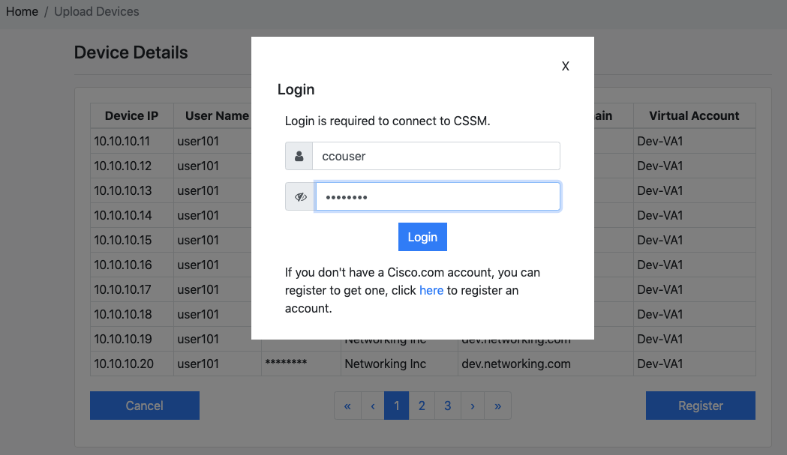  

After user clicks on 'Register', then 'Login'(if required), user will land on 'Registration Status', where the each device's registration status will be shown.  

  

User needs to click on 'Refresh' button to get the devices status refreshed. 
* The device registration status will change to 'In progress' as soon as the registration starts. 
* Status will change to 'Registered', when the device is successfully registered with CSSM.
* When a DLC is executed, the status of that device will show as 'Registered / DLC Executed' 
* If the device fails to register, failure message will be shown against the device's status

(Note: User must wait until all the devices statuses change to 'Registered' or fails, in order for the app to complete the registration)  

Now the SL Registration of uploaded devices is completed. Successfully registered devices will show up on CSSM. Log on to [CSSM](https://software.cisco.com) to check the product instances under the given SA and VA.
  
## New Registration: SLR - Disconnected Network
Disconnected Network is a network deployment where devices in that network will not have connectivity to Internet, or there is no connectivity to outside other than the devices connected within that network. Air-gapped and Dark networks are other forms of disconnected networks.  
  
Devices deployed in Disconnected Networks will not be able to perform SL product registrations. Administrators need to perform Specific License Reservation(SLR) for those devices.  
  
SLR is a multi-step registration. User needs to do the following to perform the SLR-Disconnected Network Registration:
* App must be running on a computer that can be moved/switch network connectivity between networks(disconnected network and Internet)
* User's computer should be able to reach/connect to devices(to be registered), when computer is connected to disconnected network
* User's computer should be able to reach/connect to Cisco Cloud, when computer is connected to Internet
* User has a valid Cisco account with Smart Account(SA) and Virtual Account(VA) set up properly
* VA has required licenses for the devices/products going to be registered
* Devices should have SSH access enabled with basic authentication(refer to product configuration manual to SSH and user access)
* Either devices booted with proper boot-level license configuration, or have 'License Entitlement Tag' and 'License Count' details for each device
* TFTP server in the disconnected network with write access
* Computer(when connected in disconnected network) should be able to connect to TFTP server to copy a file to tftp server
* Devices in disconnected network should be able to connect to TFTP server to get a file copied from tftp server to device
  
SLR - Disconnected Registration performed in 4 steps in the app. User needs to move/switch connectivity between the networks during these 4 steps.  
* Step 1 - CSV File Upload
* Step 2 - Generate Device Request Code on Devices
* Step 3 - Get SLR Auth Keys from CSSM
* Step 4 - Apply SLR Auth Keys on Devices  
  
Step 2 & 4 must be performed in Disconnected Network  
Step 3 must be performed in Internet  
  
(Note: Between Step 2 and 4, user will be asked to move the computer from disconnected network and internet to perform Step 3, and back to disconnected network for executing Step 4)

User needs to create a Comma Separated Value(CSV) file with device details, CSSM account details, License details and TFTP server details to perform the SLR-Disconnected Network registration. There is a sample CSV file available to download from 'Device Details Upload' in the app.  
  
Here is the content of CSV file of SLR-Disconnected Network registration:
* ipaddr - IP Address of the device
* user - User name to access the device
* password - Password to access the device
* sa_name - Smart Account(SA) Name that is associated with the user's Cisco Account(CCO)
* va_name - Virtual Account Name that belongs to the SA
* domain - Domain name of the SA
* license - (Optional) Product License Entitlement Tag
* license_count - (Optional) License Count of the license 
* tftp_server_ip - TFTP server IP Address
* tftp_server_path - TFTP Server path  
  
(Note: 
   * User's SA, VA and Domain Names can be obtained from CSSM by logging on to [CSSM](https://software.cisco.com)
   * License and License Count are optional
     * App can read these values from the device, if the device is booted with boot-level license set properly 
     * Or these values can be overridden by entering in the CSV file
       * When user sets these values in CSV and runs the app, device needs to be rebooted with matching boot-level license after the registration
   * TFTP Server should be in the Disconnected Network and should have write access)  
  
Here is a sample SLR CSV file content:
```
"ipaddr","username","password","sa_name","va_name","domain","license","license_count","tftp_server_ip","tftp_server_path"
"10.10.10.11","user101","xef$oc30","Networking Inc","Dev-VA1","dev.networking.com","","","10.30.99.12","/slapp"
"10.10.10.14","user101","xef$oc30","Networking Inc","Dev-VA1","dev.networking.com","regid.2018-06.com.cisco.DNA_NWStack,1.0_e7244e71-3ad5-4608-8bf0-d12f67c80896","1","10.30.99.12","/slapp"
```

License details in the CSV:
* When entered, license and license_count can have more than one values
* User needs to enter more than one values with space separated
* license and license_count entries should have 1:1 matching values
  * If 2 values entered for 'license', 2 values should be entered for 'license_count'  
  
When SLR CSV file is prepared, click on 'Start' to start the SLR - Disconnected Network Registration.  


Clicking 'Start' will go to 'SLR Step 1: Device Details Upload'.  
  
### SLR Step 1: Device Details Upload  
  
'SLR Step 1: Device Details Upload' will allow user to upload a SLR CSV file to register the devices.  

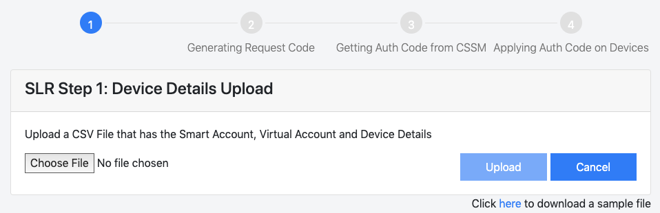  
  
(Note: There is a sample SLR CSV file available to download, click on the link to download the sample SLR CSV file)  

Click on 'Choose File' to browse and select a SLR CSV file to upload. 'Upload' button will be enabled only when the file is selected.  
  
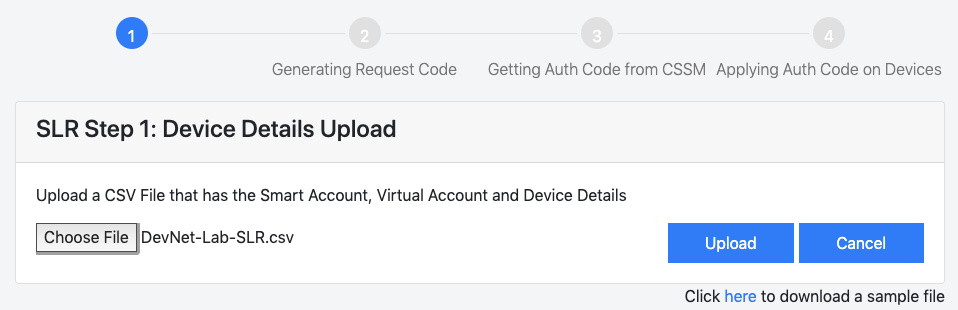  
  
When a file is selected, click on 'Upload'.

'SLR Step 2: Generating Request Code on Devices' will be shown when the uploaded file is a valid file(refer to sample SLR CSV for the format). Otherwise an error will be shown.  

### SLR Step 2: Generating Request Code on Devices
  
'SLR Step 2: Generating Request Code on Devices' will show the uploaded devices that are from CSV file content. User can check the device details that are uploaded. It is paginated, each page consists of 10 devices. If user has uploaded more than 10 devices, pagination will show page links to navigate to different pages.  

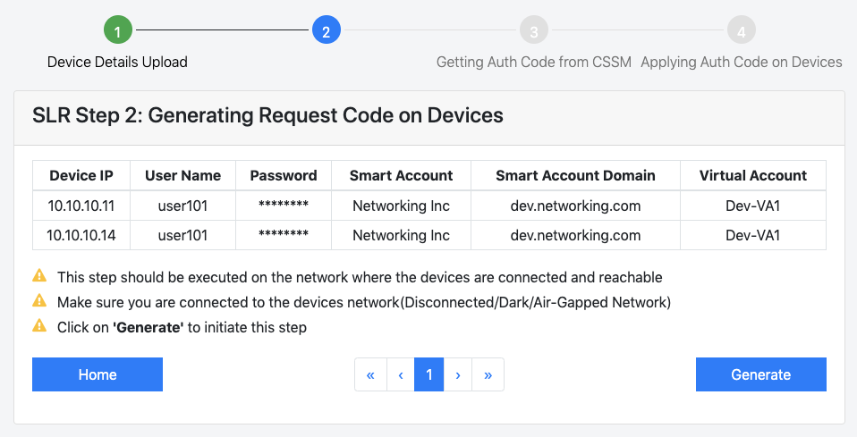  
  
App is ready to execute Step 2, Generate Request Code on Devices. There are instructions given on the page.  
* This step should be executed on the network where the devices are connected and reachable
* Make sure you are connected to the devices network(Disconnected/Dark/Air-Gapped Network)

Clicking on 'Generate' will go to 'SLR Step 2: Request Code Generation Status'.  
<br>
#### SLR Step 2: Request Code Generation Status
  
'SLR Step 2: Request Code Generation Status' will show the Status of Request Code Generation on each device.  Click on 'Refresh' to refresh the status. Do not disconnect from the network until the step is completed.

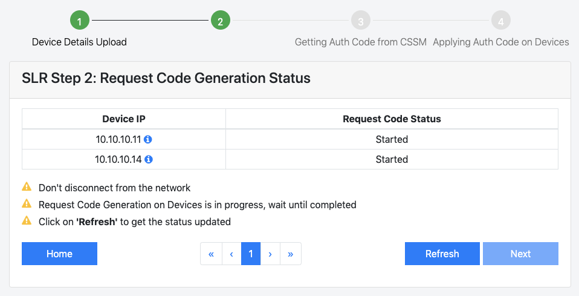  

When 'Request Code Generation' step is completed for all uploaded devices, 'Next' will be enabled. Here completion means process started for all devices and completed, the result may vary, successfully generated request code or failed. When there is a failure, the failure reason will be shown in the status against the device.

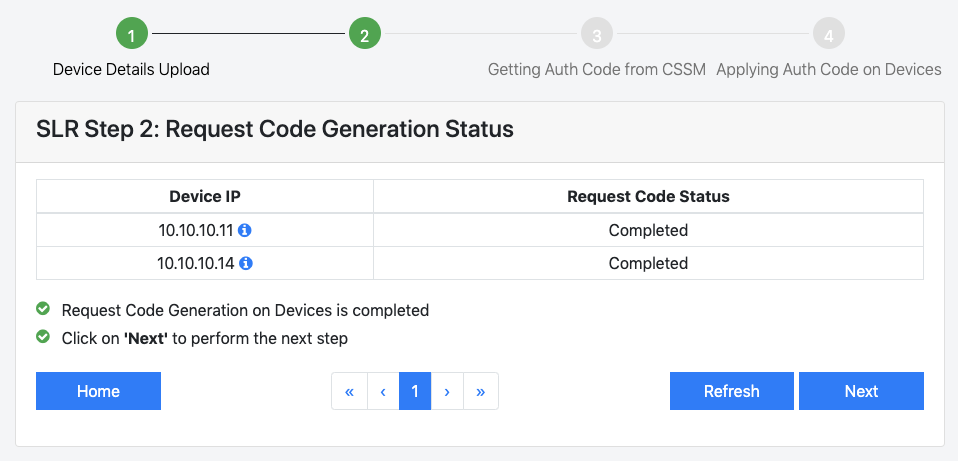  

Clicking on 'Next' will go to 'SLR Step 3: Getting Auth Key from CSSM'

### SLR Step 3: Getting Auth Key from CSSM
'SLR Step 3: Getting Auth Key from CSSM' will show the previous step status and instructions to execute this step.  
* This step should be executed on the network where Cisco Software Management(CSSM) API Server is reachable.
* User needs to make sure that the computer is to the network which has connectivity to Internet.

User needs to come out of the disconnected network and connect to a network which has internet connectivity. 

  

When user clicks on 'Get Auth Keys', following will happen:  
* User will be asked to provide the Cisco credentials to get authorized to access the CSSM
  * CSSM login pop up will show up to get username and password
  * If user has already logged into CSSM, same authorization will be re-used until it is valid
  * App will use authorization token for 45 mins, before it gets a new one
* App gets a CSSM Auth Key using CSSM REST API via Mule Soft API cloud gateway
  * App uses the following to get the Auth Key for a device
    * SA
    * VA
    * Domain
    * Device Request Code
    * License details(License Entitlement Tag and Count)
* App keeps the Auth Key to apply it on device in the next step 

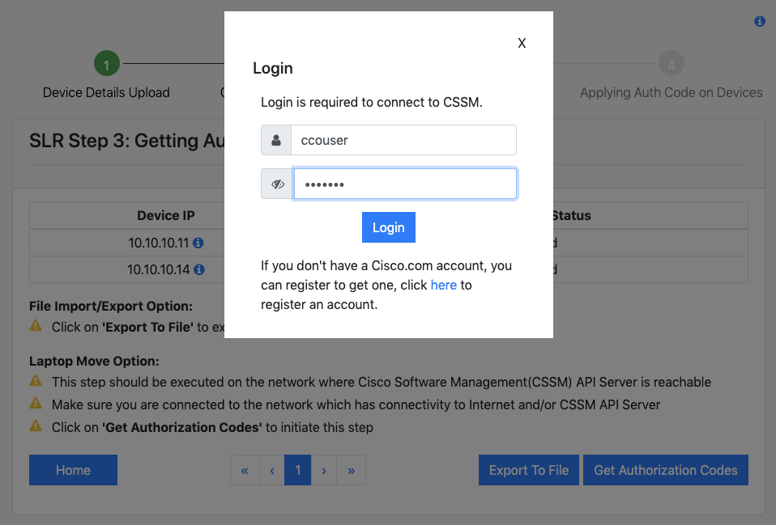  
  

After user clicks on 'Get Auth Keys', then 'Login'(if required), user will land on 'SLR Step 3: Get Auth Keys Status', where Get Auth Key Status for each device will be shown. Click on 'Refresh' to refresh the status. Do not disconnect from the network until the step is completed.  
<br> 
#### SLR Step 3: Get Auth Keys Status
  
  
  
When 'Getting Auth Keys' step is completed for all uploaded devices, 'Next' will be enabled. Here completion means process started for all devices and completed, the result may vary, successfully got the auth key or failed. When there is a failure, the failure reason will be shown in the step status against the device.  

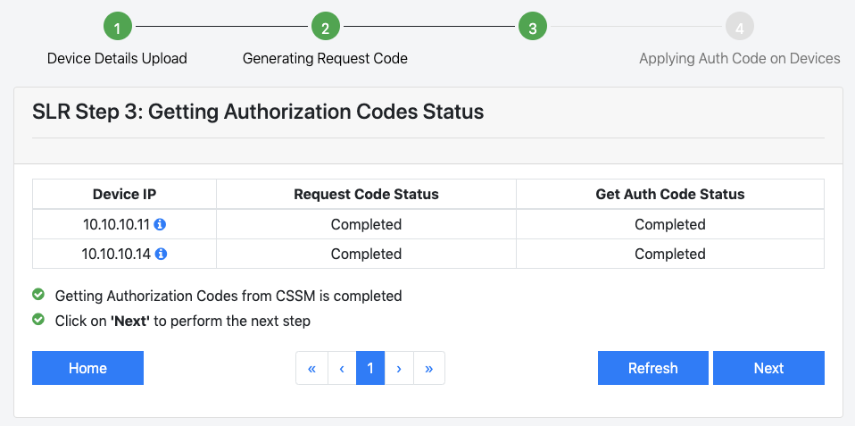  

Clicking on 'Next' will go to 'SLR Step 4: Applying Auth Key on Devices'  
  
### SLR Step 4: Applying Auth Key on Devices
'SLR Step 4: Applying Auth Key on Devices' will show the previous steps statuses and instructions to execute this step.  
* This step should be executed on the network where the devices are connected and reachable
* Make sure you are connected to the devices network(Disconnected/Dark/Air-Gapped Network)

User needs to come back to disconnected network to execute this step. 

  

Clicking on 'Apply Auth Key', app will start applying auth keys to devices, user will land on 'SLR Step 4: Applying Auth Keys Status'.

App copies the auth key file from computer to TFTP server as an intermediate place to store the auth key, then app copies the auth key file from TFTP server to device to apply the auth key on the device.  
<br>
#### SLR Step 4: Applying Auth Keys Status  
  
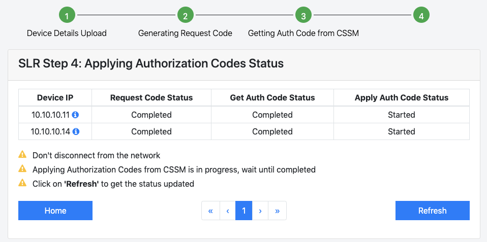  
  

'SLR Step 4: Applying Auth Keys Status' will show the status of this step. Click on 'Refresh' to check the status of this step.  
  
  
  
  
  
When all the auth keys applied to devices, the staus will change to completed. Here completion means this step process started for all devices and completed, the result may vary, successfully applied the auth key or failed. When there is a failure, the failure reason will be shown in the step status against the device.  

Now all 4 SLR steps are completed for the given devices. Log on to [CSSM](https://software.cisco.com) to see the License Reservations under the given SA and VA.

## Previous Registrations
Previous registrations will be shown in the bottom of the 'Home'.  
![App Home][AppHome]

Previous 10 registrations will be listed here. Previous Registration will have the following:
* Name - Name of the CSV file that is used for the registration
* Type - Type of the registration, SL(Connected Network) or SLR(Disconnected Network)
* Completed Time - Timestamp of the registration step completion
* Status - The completed step of the registration

'Name' in previous registrations listing is a link. Clicking on the link will allow the user to continue the steps in the registration, unless it is in 'Completed' status. If the registration is in 'Completed Status', it will show the device/s registration status, there is no step to continue.   


[AppHome]: assets/images/apphome.png
